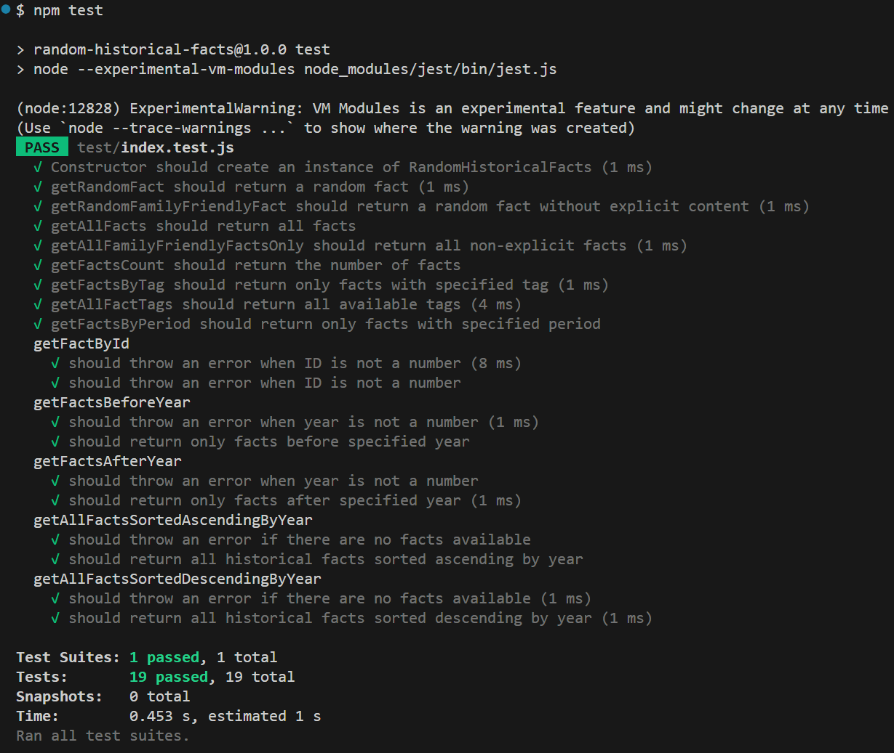

# Testrapport

## Översikt

Denna testrapport sammanfattar resultatet av alla **automatiska tester** av NPM-modulen `Random Historical Facts`. Modulen har testats med hjälp av Jest-ramverket. Testerna fokuserar på funktionalitet och felhantering för att säkerställa att användarens behov uppfylls innan implementering i extern kod. Alla 11 publika metoder har testats.

**Testramverk:** Jest 
**Testkörning:** `npm test` 
**Antal tester:** 19 
**Teststatus:** Alla tester godkända 
**Version:** 1.1.0 

## Automatiska enhetstester

   
  <i>All tests passing (19/19)</i>

## Testanalys

### Grundläggande funktionalitet
Det finns totalt tretton tester för grundläggande funktionalitet, såsom att tillhandahålla objekt som begärts av användaren och arrayer samt säkerställa att alla egenskaper finns med i det returnerade objektet. I vissa fall krävs mer omfattande validering. Till exempel behöver testningen av metoden `getAllFactTags` säkerställa att det returnerade resultatet är en array, att arrayen inte är tom och att alla element är strängar. Ett annat exempel är testet `getAllFactsSortedDescendingByYear`, som kräver att en ny instans skapas innan arrayen töms för att bevara immutabilitet.

### Validering
Det finns totalt sex tester för validering och felhantering för att säkerställa att användaren får nödvändig information vid felsökning. Alla valideringar är separerade i tre privata metoder och används sedan i `getFactById`, `getFactsBeforeYear`, `getFactsAfterYear`, `getAllFactsSortedAscendingByYear` och `getAllFactsSortedDescendingByYear`. Dessa metoder testar stränginmatning, negativa tal, icke-numerisk inmatning och tomma instanser.

## Sammanfattning
Som tidigare nämnts blev samtliga tester godkända, vilket bevisar att `Random Historical Facts` fungerar som förväntat i sin nuvarande version. NPM-paketet är redo att användas av andra utvecklare.